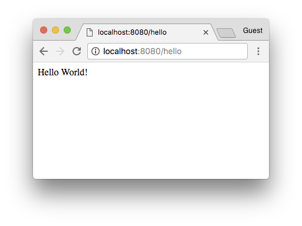
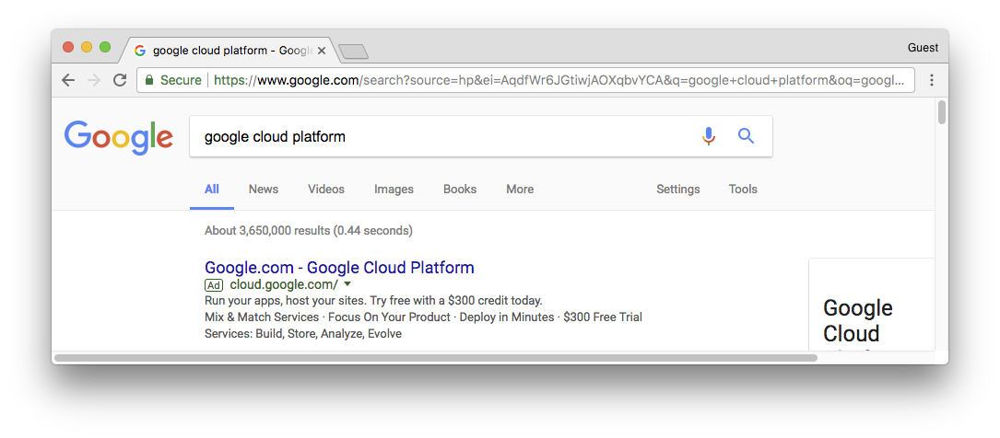
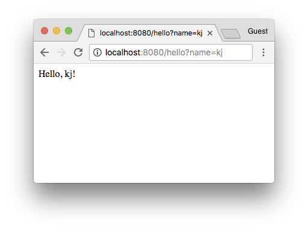

# Google Cloud Platform Workshop

This repository contains workshops as part of a presentation on Google Cloud Platform. Use this README to follow along with the workshops.

## Prerequisites:

Google Cloud Platform provides an awesome feature called [Cloud Shell](https://cloud.google.com/shell/) which is a lightweight web shell that includes dependencies like the Cloud SDK and Node.js.

If you are uncomfortable working and editing in the shell, you will need to install the following to complete this workshop:

- [Node.js](https://nodejs.org/)
  - This adds `node` and `npm` (Node Package Manager) to the command line.
- [Cloud SDK](https://cloud.google.com/sdk/downloads)
  - This adds `gcloud` to the command line.

## WORKSHOP: Setting up a project

### Description

In this workshop, you will create a Google Cloud Platform project. A project organizes all your Google Cloud Platform resources.

### Instructions

1. Navigate to [Cloud Console](https://console.cloud.google.com).
1. Sign in with a personal or @cornell.edu account.
1. If you already have an active Google Cloud Platform trial or credit, skip ahead to step 6.
1. If you have not activated a free trial, you should see the following image:

If you would like, you can sign up for this free trial. Doing this will require a credit card for identification purposes.
1. If you cannot or do not wish to activate the free trial, ask a Googler for a credit key.
1. Pick a name for your GCP project with the prefix `cornell-gcp-2018sp-`. For example, `cornell-gcp-2018sp-foo`.
1. Follow the instructions at the top of [this](https://cloud.google.com/resource-manager/docs/creating-managing-projects) page to create a Google Cloud Platform project with the name you picked.
1. At the [homepage](https://console.cloud.google.com) of GCP, note your project id which may be different from your project name. Submit this project id (e.g. `cornell-gcp-2018sp-foo-115671`) on [this](https://goo.gl/forms/4YF8jiP5kX9r8lNp2) form.

## WORKSHOP: Google Cloud Translate API in Node.js

### Description

This workshop will take you through building a Google Translate-like web service using the Google Cloud Translate API and Node.js. You'll be able to launch your app on Google App Engine (GAE) to make it accessible anywhere!

### Instructions

#### Install Dependencies

If you haven't already, clone this repository by running the following in your terminal: `git clone https://github.com/TrevorEdwards/gcp-workshop`

Next, navigate to the `gae-translate` directory in your terminal and then run `npm install` (`npm` is Node's package manager) to install the dependencies you'll need for this application:

```sh
cd gcp-workshop/gae-translate
npm install # This installs dependencies, such as the Google Translate API, as specified by the package.json file in this directory.
```

#### Translate in the command line

We've provided a skeleton [`translate.js`](gae-translate/translate.js) script which translates a hard-coded string `'hi!'` from English to Spanish. Try it by running:

```sh
node translate.js
```

Try modifying the source code (`translate.js`) to allow the script to accept a message to translate through the command line. For example:

```sh
node translate.js "i'm using google translate"
# Prints "estoy usando el traductor de google"
# Keep in mind that in most shells you can't use an exclamation (!)
```

As a hint, [Node provides the command line arguments as an array `process.argv`.](https://gist.github.com/kjin/bca38eeec9daec4da1431ac7c0ce4b2f)

#### Run a basic web server

Along with the script above, there's also a basic web server [`server.js`](gae-translate/server.js) in the same directory. Try running it:

```sh
node server.js
```

Note that this time, the script doesn't exit immediately. That's because it's running a web server! To see it in action, open up your favorite browser and navigate to `http://localhost:8080/hello`:



Now, open `server.js` in your favorite editor to see what's happening!

#### Accept inputs through the web server

Observe the request handler in `server.js`:

```js
function handleHelloRequest(request, response) {
  response.send('Hello World!');
}
```

This function runs every time someone hits the `/hello` path on your web server. It gets passed two objects -- a request object, which contains information about the incoming request, and a response object, which contains methods to manipulate the response given back to the user. Right now, we send a hard-coded string back, and ignore `request` entirely. Let's try changing this so that we can accept user input.

One possible way for web servers to accept user input is through _query parameters_. Consider what happens when you search for something on Google:



The URL you get redirected to contains the information sent to Google to perform the search. Anything that comes after the `https://www.google.com/search?` part of the URL is the query parameter. It's fairly complicated, but if you crop out the non-essential information it really just boils down to:

```
https://www.google.com/search?q=google+cloud+platform
```

The query parameter in this case is a simple key-value mapping, equivalent to:

```js
{
  q: 'google+cloud+platform'
}
```

The query parameters in your application are accessible through the field `request.query`:

```js
function handleHelloRequest(request, response) {
  console.log(request.query);
  response.send('Hello World!');
}
```

If you restart your server and try navigating to `http://localhost:8080/hello?name=kj`, which contains a query parameter, observe what gets printed in the console:

```js
// This gets printed when you hit http://localhost:8080/hello?name=kj in your browser
{ name: 'kj' }
// An empty object gets printed if you don't specify a query parameter (http://localhost:8080/hello)
{}
// You can have multiple query parameters separated by & (http://localhost:8080/hello?name=kj&company=google)
{ name: 'kj', company: 'google' }
```

Now, try changing `handleHelloRequest` so that when a query parameter `name` is specified, respond with "Hello, [name]!". Be sure to cover the case where there isn't a query parameter!



#### Putting it together

## WORKSHOP: Google Cloud Functions - Adding Numbers

### Description

In this workshop, you will implement a simple Google Cloud Function that adds two numbers.

### Instructions

1. Navigate to your Google Cloud Functions [console](https://console.cloud.google.com/functions/list).
1. Create a new HTTP function called `case1`. Leave all options to their defaults.
1. Replace the existing `index.js` function with this [template](https://github.com/TrevorEdwards/gcp-workshop/blob/master/gcf/problems/1/index_template.js).
1. Implement the TODOs in `index.js`.
1. Test your function using the [testing tab](https://pantheon.corp.google.com/functions/details/us-central1/case1?&tab=testing) with [this](https://github.com/TrevorEdwards/gcp-workshop/blob/master/gcf/problems/1/test_case_1.json) test case.
1. Do more tests as desired. Keep an eye on the scoreboard for your project! Feel free to ask for help!

## WORKSHOP: Google Cloud Functions - Translate Similarity

### Description

In this workshop, you will implement a Google Cloud Function which translates a sentence to a target language and back,
then returns the similarity between the original sentence and its translated version.

### Instructions

1. Enable the Google Cloud Translation API if you have not already [here](https://console.cloud.google.com/apis/api/translate.googleapis.com/overview).
1. Navigate to your Google Cloud Functions [console](https://console.cloud.google.com/functions/list).
1. Create a new HTTP function called `case2`. Leave all options to their defaults.
1. Replace the existing `index.js` function with this [template](https://github.com/TrevorEdwards/gcp-workshop/blob/master/gcf/problems/2/index_template.js).
1. Replace the existing `package.json` with this [template](https://github.com/TrevorEdwards/gcp-workshop/blob/master/gcf/problems/2/package_template.json).
1. Implement all three TODOs in `index.js`.
1. Test your function using the [testing tab](https://console.cloud.google.com/functions/details/us-central1/case2?&tab=testing) with [this](https://github.com/TrevorEdwards/gcp-workshop/blob/master/gcf/problems/2/sample_input.json) test case.
1. Do more tests as desired. Keep an eye on the scoreboard for your project! Feel free to ask for help!
