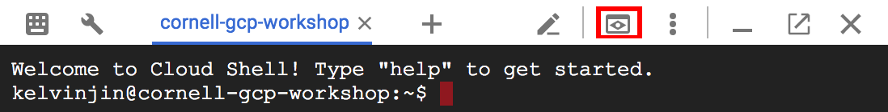

# Google Cloud Platform Workshop - Hackathon Edition

This repository contains workshops as part of a hackathon presentation on Google Cloud
Platform. Use this README to follow along with the workshops.

## WORKSHOP: Setting up a project

### Description

In this workshop, you will setup a billing account and create a Google Cloud Platform project. A project
organizes all your Google Cloud Platform resources.

### Set up Billing

1.  Navigate to [Cloud Console](https://console.cloud.google.com).
1.  Sign in with a personal or @\*.edu account (if it is Google-supported).
1.  If you already have an active Google Cloud Platform trial or credit, skip
    ahead to the "Environment" section.
1.  If you have not activated a free trial, you should see an image similar tfo
    the following:
    
    If you would like, you can sign up for this free trial. Doing this will
    require a credit card for identification purposes.
1.  If you cannot or do not wish to activate the free trial, ask a Googler for a
    credit key and redeem it [here](https://console.cloud.google.com/education).
1.  If you have a partner, add them to your coupon's billing account as a Billing Account Administrator (Top-left menu -> Billing -> Add Members/Select a role -> Add). This will allow them to continue to the Environment section in their own console with their own project.

### Environment

You can choose to run this either in Cloud Shell __(strongly recommended)__ or on your own machine. If you choose to run on your own machine, follow the additional instructions under "Using your own machine".

Navigate to Cloud Shell by clicking on the following button (outlined in red) in the Cloud Console:


Clone this repository with the following command:

```sh
git clone https://github.com/TrevorEdwards/gcp-workshop-hackathon-edition
```

Navigate to the repository directory:

```sh
cd gcp-workshop-hackathon-edition
```

### Create a project

Follow the instructions
[here](https://cloud.google.com/resource-manager/docs/creating-managing-projects#creating_a_project)
to create your own project.

While creating this project, you will get a project id. Note this down as you
will need it at a later step. If you ever forget it, you can see it at the [cloud
console homepage](https://console.cloud.google.com).

### Enable APIs

The top of [Cloud Console](https://console.cloud.google.com) has a search bar where you can look up resources, APIs,
etc. Use this search bar to find and enable the following APIs:
- Google Cloud Translation
- App Engine Flexible Environment

For more info on enabling APIs look [here](https://support.google.com/cloud/answer/6158841?hl=en).

### Create a service account

Service accounts are accounts which are authorized to perform actions on your
behalf. We will need to create one in order to authenticate with Google APIs
when running App Engine locally from Cloud Shell.

To create a service account, run:

```sh
gcloud iam service-accounts create my-service-account
```

Now, download the account's credentials into your Cloud Shell environment. You
will need to replace ${MY\_PROJECT\_ID} with your own project ID which you obtained
when creating the project.

```sh
gcloud iam service-accounts keys create key.json --iam-account=my-service-account@${MY_PROJECT_ID}.iam.gserviceaccount.com
```

Finally, export an environment variable so that processes can discover the key:

```sh
export GOOGLE_APPLICATION_CREDENTIALS="${PWD}/key.json"
```

If you accidentally close your shell, you will need to navigate to the directory
containing the key and re-run this command.

#### Using your own machine

Before doing the above, you'll need to download [`gcloud`](https://cloud.google.com/sdk/gcloud/) first. As an extra step, you'll need to login with:

```bash
gcloud auth login
```

You will also need to download and install [Node.js 8](https://nodejs.org).

After that, you should be all set to continue as if you were running in the Cloud Shell in the instructions above.

## WORKSHOP: Writing a Cloud Translation Service in Node.js

### Description

This workshop will take you through building a Google Translate-like web service
using the Google Cloud Translate API and Node.js. You'll be able to launch your
app on Google App Engine (GAE) to deploy it to the world!

### Install Dependencies

Navigate to the `gae-translate` directory in your Cloud Shell:

```sh
cd gae-translate
```

Then, run `npm install` (`npm` is Node's package manager) to install the
dependencies you'll need for this application:

```sh
npm install # This installs dependencies, such as the Google Translate API, as specified by the package.json file in this directory.
```

### Run the server

We've already provided most of the code for you. Start the application by typing the following at the command line:

```sh
node server.js
```

This starts a long-running application that will serve browser requests on port 8080 of the local machine. To see what this looks like, click the "Web Preview" button in the top right of your cloud shell (outlined in red in the below image) -- which will automatically open up a new tab showing your running web app.



(If you have the menu on the left of the screen open, you will have to minimize it before you can see this icon.)

Though barebones, the interface should seem [pretty familiar](https://translate.google.com/). However, there's only two languages in the drop-down menu -- English and Spanish. This is because the server implementation is incomplete. Open up `server.js` and take a look at the code. See if you can fill in the missing part of the code (the part that fetches languages), using the other portions of the code as an example!

_Hint:_ Using your browser's developer console can be helpful for figuring out what exactly is happening under the hood. In Chrome, you can open it by right-clicking anywhere on the web page, clicking, "Inspect", and then changing to the "Sources" or "Network" tab in the console.

### Deploy the application

Once you've filled up the missing part and tinkered around with the code, it's time to deploy the application on Google App Engine. Simply type the following command:

```sh
gcloud app deploy
```

Feel free to pick any region here.

It'll take a few minutes, but in the end you'll see your application deployed to a real production environment!

__Why this works:__ A configuration file named `app.yaml` sits in your working directory. This is the config file used for Google App Engine. It contains just enough information for App Engine to know that you want to use Node.js (`runtime`) on App Engine Flex, the Docker-based version of App Engine (`flex`). See [this page](https://cloud.google.com/appengine/docs/flexible/nodejs/configuring-your-app-with-app-yaml) for more details.

## Learn more about GCP

If you to do more interactive demos with GCP, check out
https://codelabs.developers.google.com/

## About the workshop

This workshop is adapted from [another
workshop](https://github.com/TrevorEdwards/gcp-workshop).

